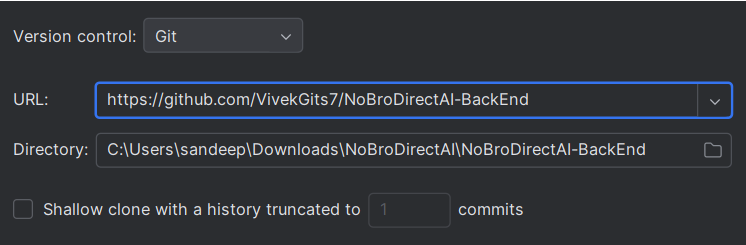
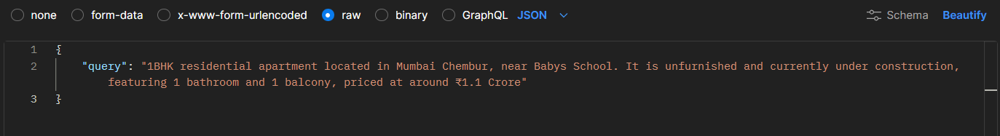
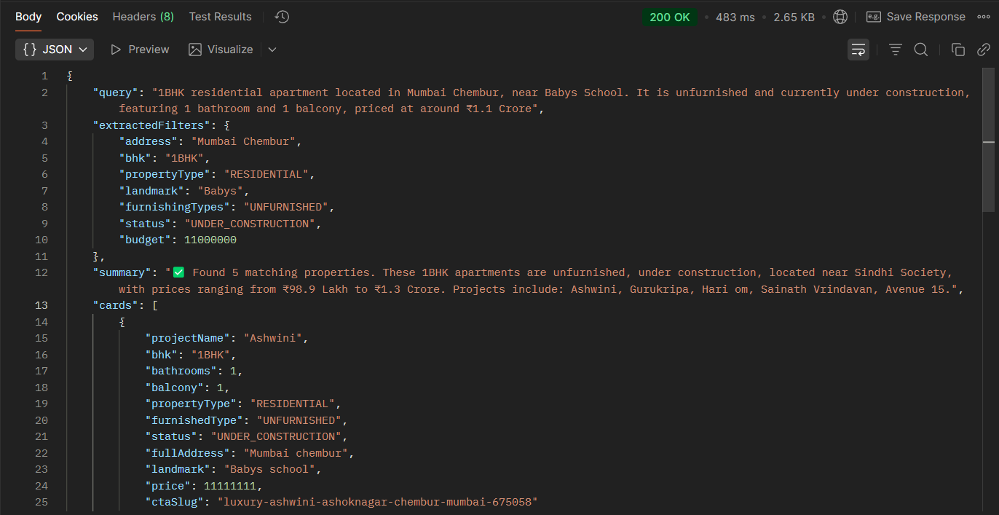
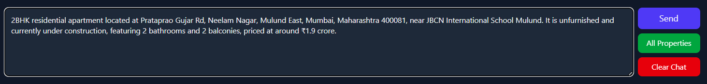
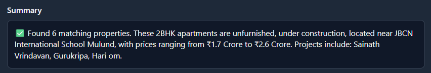

**<u>NoBroDirectAI – Property Finder Chat
AI</u>**

**LinkedIn:**
**[*<u>https://www.linkedin.com/in/vivek-vishwakarma-</u>*](https://www.linkedin.com/in/vivek-vishwakarma-)Project**
**GitHub:**
[***<u>https://github.com/VivekGits7/Property-Search-Chat-AI</u>***](https://github.com/VivekGits7/Property-Search-Chat-AI)

**Specific** **Frontend** **code** **GitHub:**
[***<u>https://github.com/VivekGits7/NoBroDirectAI-FrontEnd</u>***](https://github.com/VivekGits7/NoBroDirectAI-FrontEnd)
**Specific** **Backend** **code** **GitHub:**
[***<u>https://github.com/VivekGits7/NoBroDirectAI-BackEnd</u>***](https://github.com/VivekGits7/NoBroDirectAI-BackEnd)

**<u>Project Summary:</u>**

This project aims to build an intelligent **Chat** **Search** **AI**
**system** that helps users find real estate projects through natural
language queries like “3BHK flat in Pune under ₹1.2 Cr.”

Instead of using filters, users can chat with the interface—built using
React + Tailwind CSS —to get instant, data-driven property
recommendations. The backend (powered by Java Spring Boot ) processes
user messages, extracts key filters such as city, BHK type, budget, and
locality, and searches through the provided CSV datasets containing
project, address, and configuration details.

It then generates a short, meaningful summary based solely on CSV data
and displays a list of matching project cards with details like price,
location, status, and BHK. This system combines natural language
understanding, structured data retrieval, and a user-friendly interface
to make property discovery faster, smarter, and more interactive.

**<u>Tech Stack</u>**

**Programming** **Languages:** Java17, JavaScript

**Core** **Concepts:** Data Structures & Algorithms, Object-Oriented
Programming (OOP), Problem Solving.

**Java** **Frameworks** **&** **Libraries:** Spring, Spring Boot,
Lombok, commons-csv

**Build** **&** **Tools:** Maven, Postman, GSON, JSON, and API
Documentation (Swagger) **Back-End** **Development:** RESTful APIs and
designing with Microservices Architecture. **Application** **Servers:**
Experience with Embedded Tomcat for Java applications.

**Front-End** **Frameworks:** Tailwind CSS, React.js.

**Web** **Technologies:** HTML5, CSS3, JavaScript and YAML. **Version**
**Control:** Git, GitHub

**IDEs:** IntelliJ IDEA, WebStorm, and Visual Studio Code for
development and debugging.

**<u>Setup Guide</u>**

**<u>Frontend Setup Guide</u>**

**1.** **Clone** **the** **Repo**

**Open** **a** **terminal** **in** **VS** **Code** **or** **WebStorm**
**and** **run:**

***git*** ***clone***
[***<u>https://github.com/VivekGits7/NoBroDirectAI-FrontEnd.git</u>***](https://github.com/VivekGits7/NoBroDirectAI-FrontEnd.git)

**Then** **go** **inside** **the** **project** **folder:** ***cd***
***NoBroDirectAI-FrontEnd***

**2.** **Install** **Dependencies**

**Since** **node_modules** **is** **not** **in** **your** **repo,**
**install** **them** **fresh** **using** **npm:** ***npm***
***install***

**This** **reads** **the** **package.json** **file** **and**
**downloads** **all** **required** **libraries** **(React,** **Vite,**
**Tailwind,** **Framer** **Motion,** **etc.)** **into** **a** **new**
**node_modules** **folder.**

**3.** **Run** **the** **Development** **Server** **Start** **the**
**app** **with:** ***npm*** ***run*** ***dev***

**After** **a** **few** **seconds,** **you’ll** **see** **an**
**output** **like:** *VITE* *v5.0.0* *ready* *in* *400ms*

➜ *Local:* *http://localhost:5173/*

**Open** **that** **URL** **in** **your** **browser.**

**<u>Backend Setup Guide</u>** **1.** **Clone** **the** **Repo**

Open a terminal in **IntelliJ** **IDEA** or **Eclipse** **IDE** and run:

In the **IntelliJ** **IDEA** Project Section, click the Clone Repository
button and give the **Backend** **code** **repo** **URL:**
***https://github.com/VivekGits7/NoBroDirectAI-BackEnd***

Then go inside the project folder: ***cd*** ***NoBroDirectAI-BackEnd***
**2.** **Check** **Maven** **Dependencies**

If not automatically downloaded, you can manually install them:
***mvn*** ***clean*** ***install***

This will:

> • Download all dependencies from pom.xml • Compile the source
>
> • Create the target folder with the .jar file

**3.** **Run** **the** **Spring** **Boot** **Application**

Run this command inside the project root: ***mvn*** ***spring-boot:***
***run***

**Backend** **is** **running** **on:**
[***<u>http://localhost:8083</u>***](http://localhost:8083/) **Or**
**Run** **the** **JAR** **File**

**Run** **your** **Spring** **Boot** **backend:**

***java*** ***-jar*** ***NoBroDirectAI-BackEnd.jar***

**4.** **Verify** **API** **Endpoint**

Test your main API using Postman or Curl:

POST *http://localhost:8083/api/search* Content-Type: application/json

{

"query": "1BHK residential apartment located at Prataprao Gujar Rd,
Neelam Nagar, Mulund East, Mumbai, Maharashtra 400081, near JBCN
International School Mulund.

It is unfurnished and currently under construction, featuring 1 bathroom
and 1 balcony, priced at around ₹1.2 crore.

" }

**5.** **Folder** **Structure** **Overview** NoBroDiractAI-BackEnd/ Root
contains:

> • src/
>
> o main/
>
> ▪ java/com/NoBrokerage/NoBroDirectAI/
>
> ▪ controller/ → REST controllers (API endpoints) ▪ service/ → Business
> logic
>
> ▪ utils/ → Helper classes
>
> ▪ dto/ → Data transfer objects ▪ resources/
>
> ▪ application.properties → Server port, DB config ▪ data/ → Optional
> CSV folder
>
> o test/ → Unit tests
>
> • pom.xml → Maven dependencies • README.md → Project info

**6.** **Change** **Port** **or** **Config** **(Optional)** If port 8083
is busy, change it in:

src/main/resources/application.properties server.port=8083

**7.** **Connect** **Frontend** **+** **Backend** Once the backend is
running:

> • Make sure your frontend’s .env file has: •
> VITE_API_URL=http://localhost:8083
>
> • Then start your frontend: • npm run dev
>
> • The React chat UI will call your backend endpoint at
> http://localhost:8083/api/search

**<u>API Endpoints Overview</u>**

**1.** **Search** **Projects**

> **URL:** POST localhost:8083/api/search
>
> **Description:** Accepts a search query and returns matching
> property/project listings from the CSV data store.
>
> **Request** **Body** **Example:**
>
>  style="width:7.08681in;height:3.65208in" />**Response** **Example:**
>
> **Notes:** The summary is derived **only** from the CSV datasets (no
> external data). The project's array lists matched items with key
> details. If no matches are found, it returns a message summarising the
> absence and may propose broader
> filters.

**2.** **(Potential)** **Other** **Endpoints**

Based on the project’s architecture (controller/service layers) you may
have or add these endpoints in the future:

> **Endpoint** **Method** **Purpose**
>
> GET /api/allProperties GET Retrieve all properties detailed from the
> CSV file
>
> POST /api/filter
>
> GET /api/health

POST Takes natural language text and extracts filters

GET Health-check endpoint (status of service/data)

**Note:** These are suggested/typical endpoints; verify their presence
in your code. If any exist in your controller package, document them
similarly.

**<u>Frontend UI Overview</u>**

The app has 4 main sections:

> **Section**
>
> **Header**

**Description**

Shows project title and links to your profiles

>  style="width:7.08681in;height:3.3493in" />**Notes** **Section**
> Detailed guide on how to format queries for best results **Chat**
> **Window** Shows a conversation between the user and the AI (bot)
> **Input** **Panel** For typing messages and using control buttons

**Detailed** **Feature** **Guide**

**1.** **Header** **Includes:**

> • **LinkedIn** **Button** → Opens your LinkedIn profile
>
> • **GitHub** **Button** → Opens your GitHub
> profile style="width:7.08681in;height:0.85278in" />

**2.** **Notes** **Section**

This section helps users understand how to use your AI correctly.
**Buttons:**

> • **Expand** **/** **Collapse**
>
> o Expands the full instructional text for easy reading o Collapses it
> into a small box when not needed

**Content** **Includes:**

> • Purpose of the AI
>
> • Correct prompt structure • Example searches
>
> • Field meanings (BHK, Status, Price, etc.) • API details (/api/search
> endpoint)

**3.** **Chat** **Section**

The main area where user and AI messages appear. **Message** **Types**

> **Type** **Role** **Style**
>
> **User** role: "user" Purple background, right-aligned **Bot**
> **(Assistant)** role: "bot" Gray background, left-aligned

**4.** **AI** **Responses**

Each AI (bot) message can include multiple sections:

**a)** **Extracted** **Filters**

Displays what filters your backend extracted from the user query (e.g.,
city, bhk, budget).

**b)** **Summary**

Short text summarising the
search results — generated by your backend (e.g., “Found 5 ready-to-move
2BHK flats in Pune…”)

**c)** **Cards**

Each property is shown in a **card** **format**, containing: • Project
Name

> • Full Address • Landmark
>
> • BHK, Bathrooms, Balconies • Property Type
>
> • Furnishing • Status
>
> • Price

**5.** **Expandable** **“Show** **Slug”** **Feature**

Each property card has a small link at the bottom:

When clicked, it expands to
show the backend’s ctaSlug or a placeholder if not available. This is
helpful for internal reference or frontend routing.

**6.** **Input** **+** **Control** **Buttons**

At the bottom (sticky fixed section):

> **Button** **Function**
>
> **Send** handleSend()

**Description**

Sends the user’s text to backend endpoint /api/search via POST

> **All** **Properties**

handleAllProperties() Fetches all properties via /api/allProperties

> **Clear** **Chat** setMessages(\[\]) Clears all chat history from UI

**7.** **API** **Calls**

**POST** **/api/search**

Used when the user sends a query.

**GET** **/api/allProperties**

Returns **all** **available** **properties** in the dataset.

**8.** **Loading** **&** **Error** **Handling** While requests are in
progress:

> • The **Send** button shows Sending...
>
> • If the backend fails to respond: Error: Server returned 500

**9.** **Clear** **Chat**

Quickly resets the UI:

**10.** **Smart** **Scroll**

> • Automatically scrolls to bottom on new messages.
>
> • Smoothly scrolls to the Notes section when expanded.
